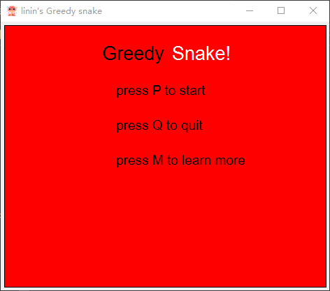
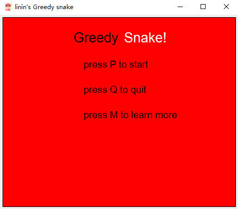

# linin's Snake

## 预览

## 功能

1. 开始菜单
    
    
2. 四种不同果实

3. 随机生成墙壁

4. 撞墙或撞到自身的判断

5. 速度调节

6. 暂停与继续

7. 复活

## 设计思路

1. 数据结构的定义
     游戏场景为一个二维数组，贪吃蛇是一个动态链表，墙和果实是随机坐标点
2. 界面刷新
   *  将表示贪吃蛇的链表与定时器的信号槽绑定
   *  以一定频率刷新界面以实现贪吃蛇移动的可视化
3. 键盘监听
   * 接受选项和改变方向的指令
   * 根据指令维护贪吃蛇链表
4. 蛇移动逻辑
   * 总是朝当前方向前进
   * 增加头节点，删除尾节点
   * 若吃到果实则根据果实类型实现不同变化，并重新生成果实
5. 果实与墙的生成
   * 随机生成
   * 若与蛇位置重叠则重新生成
6. 不同果实介绍
   * 绿色的是生命果实，吃到后可以加一条生命
   * 黄色的是加速果实，可以加快速度
   * 蓝色的是减速果实
   * 白色的是普通果实
   * 吃到一个果实加一分，吃到普通果实可以不删除尾节点
